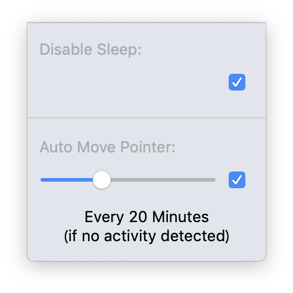

# What is this
Assume you are remote worker. When you want to sleep or go outside or do something other than work during working hours, doing them has risks of deactivating Slack presence mark.  
This tool enable slack presence fraud by an analog way;  disabling sleep and firing mouse movement event.  

# Presence Detection of Slack App

You cannnot be marked as "active" by just running Slack app.  
Although you launched slack, once 30 minutes elaped, you are marked as "away". [ref](https://api.slack.com/docs/presence-and-status#user_presence)   
Currently, Slack app might monitor user activity(mouse move, keyboard input and so on).

